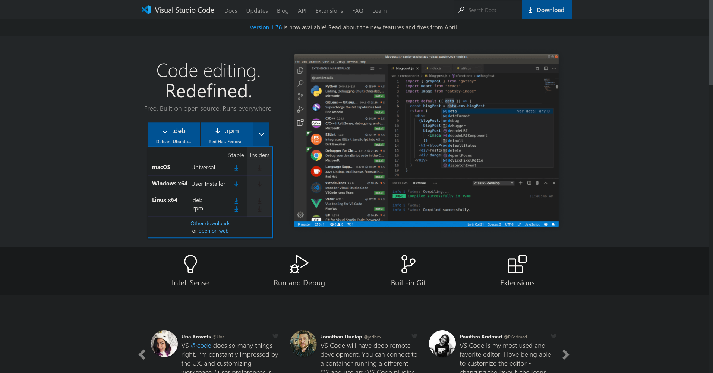
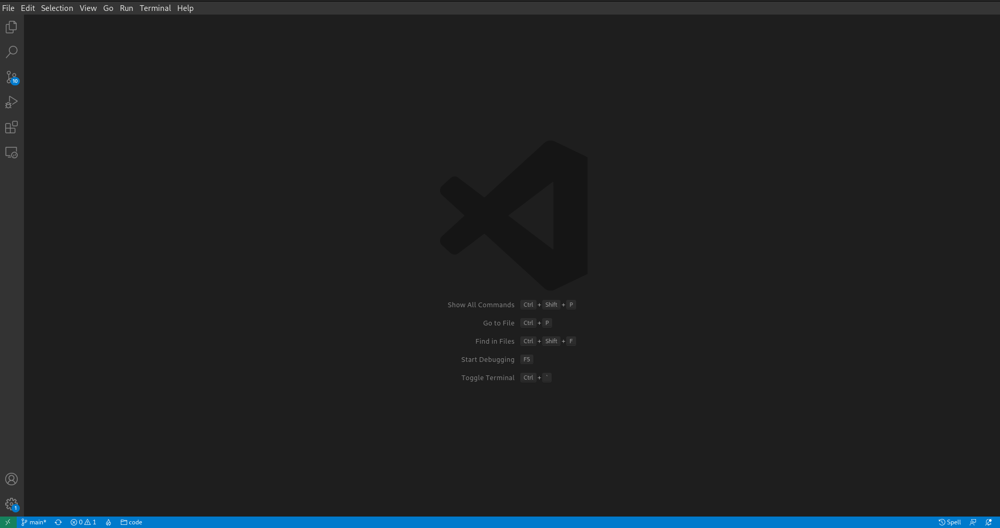
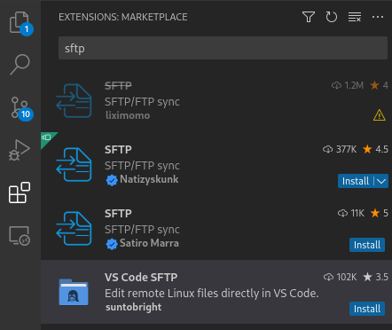
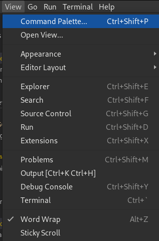
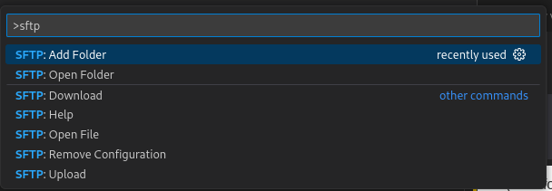
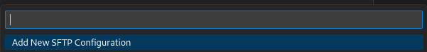
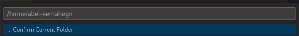

## Background
---
### What is Visual Studio Code?
[Visual Studio Code or VS code](https://code.visualstudio.com/) is a source code editor that allows users to add 
extensions to fit their needs. Released on April 29, 2015, it has become a tool developers around the world use day to day. It is [available]
(https://code.visualstudio.com/) on Mac, Windows and linux.

---


## The Tutorial

First, you will need to go to the Visual Studio Code website and install Visual Studio Code for your system.



After completing the install process, you will be presented with a start screen on first opening.



On the left-hand side, there is a bar with different options, and for the sake of time, we will only worry about one of the options. Click the extension icon.


After you click it, go to the search bar and type "SFTP".



(note for this tutorial we will use the excision ["vs code SFTP"](https://marketplace.visualstudio.com/items?itemName=suntobright.vscode-sftp))

Install the highlighted extension titled ["VS Code SFTP."](https://marketplace.visualstudio.com/items?itemName=suntobright.vscode-sftp). Note that you may need to reload Visual Studio Code.

Once you have installed the extension and reloaded your VS code, click the "View" tab on the menu bar.


Click the commandpallet option:



Once you click this, a popup will appear. In the search field, type "SFTP", and an option titled "SFTP: add folder", will appear. Click this.



Once you have clicked this, you will be presented with the option to create a new connection.



Once you do that, it will generate a new file called "sftConfig.json". It will look like this:

```json
{
    "comment": "Please fill the following configuration, save it, then close the tab.",
    "host": "hostname_or_IP",
    "port": 22,
    "username": "username",
    "password": "password"
}
```

But for this tutorial, delete the boilerplate given; instead, use this:

```json
{
    "comment": "Please fill the following configuration, save it, then close the tab.",
    "host": "ssh.codermerlin.com",
    "port": 443,
    "username": "joe-mama",
    "password": "password123" 
}
```
After finishing, save the file with "Ctrl + s", and you can close the file. Once you do, a pop-up on the lower right-hand corner will appear. In the lower right corner, Click accept.

If everything went right, a prompt should appear at the top of the application.



Click ".Confirm Current Folder". This will drop you in the home directory with all of your files. Now you can edit all of your files while using all of your favorite extensions. 
